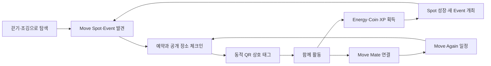
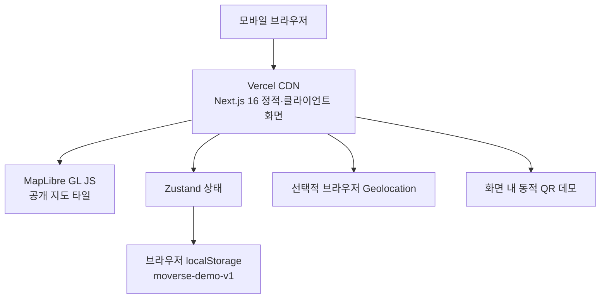
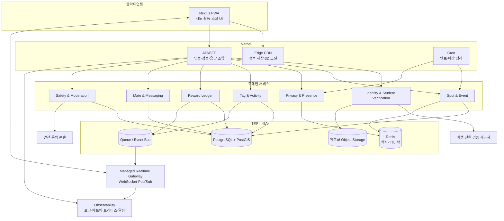
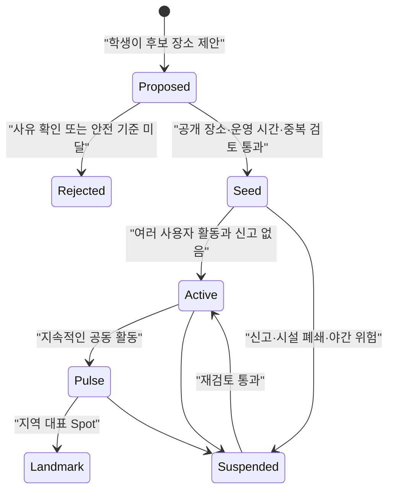
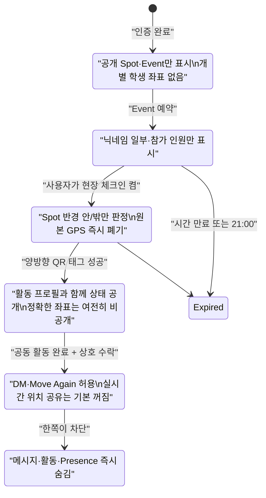
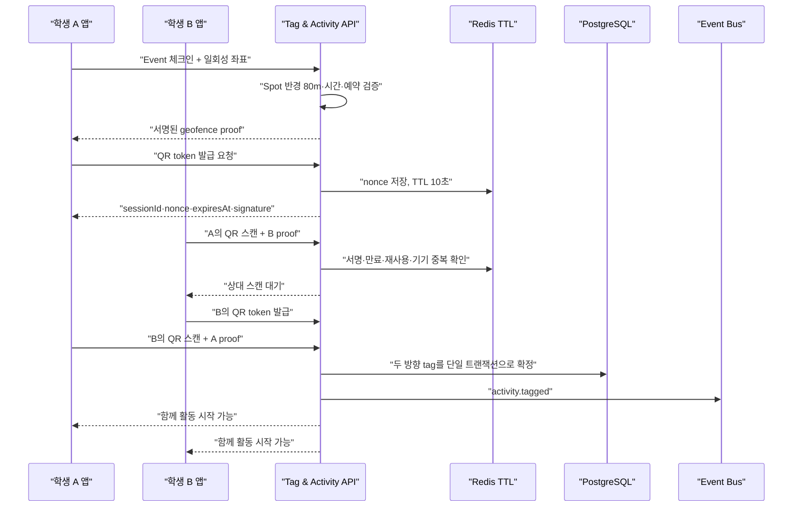
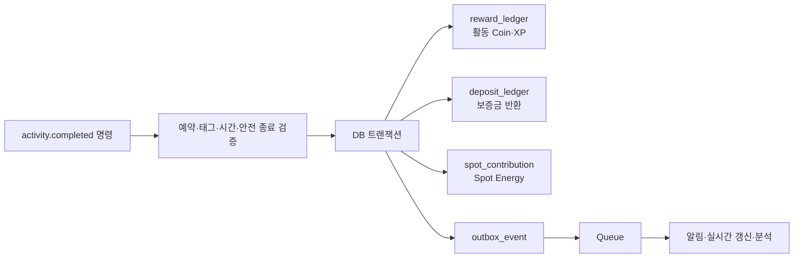
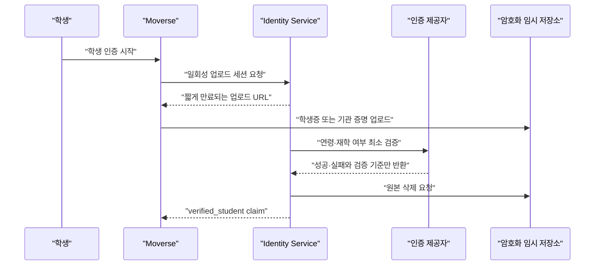
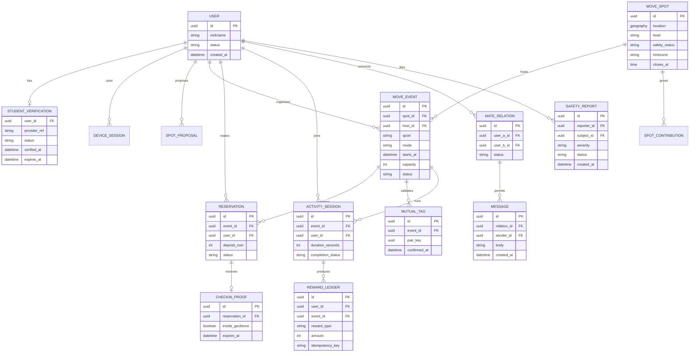
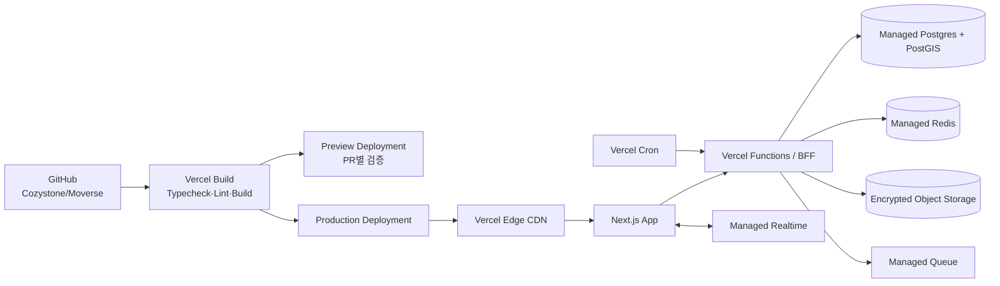

# Moverse 시스템 아키텍처

> 인증된 학생이 안전한 공개 장소에서 만나 함께 움직이고, 그 결과로 사람·장소·커뮤니티가 성장하는 지도 중심 활동 플랫폼

이 문서는 현재 대회용 데모가 실제로 구현한 범위와, 서비스 운영을 위해 필요한 목표 아키텍처를 명확히 나눈다. 구성 방식은 [ByteByteGo System Design 101](https://github.com/ByteByteGoHq/system-design-101)의 시스템 설계 관점처럼 요구사항, 데이터 흐름, 병목, 장애 대응을 한눈에 확인할 수 있도록 정리했다.

## 1. 설계 목표

Moverse의 핵심 루프는 다음과 같다.

설계 우선순위는 아래 순서다.

1. **청소년 안전과 위치 프라이버시**: 사람의 정확한 좌표가 아니라 공개 Spot과 Event를 먼저 보여 준다.
2. **현실 만남의 증명**: GPS 반경 확인과 짧게 만료되는 동적 QR의 상호 태그를 결합한다.
3. **보상 무결성**: 참가 보증금, 활동 보상, 개최 비용을 중복 지급할 수 없는 원장으로 관리한다.
4. **지도 중심 반응성**: 현재 화면 안의 Spot과 Event를 빠르게 찾고, 실시간 변화는 작은 이벤트로 전달한다.
5. **안전한 관계 형성**: 실제 공동 활동과 상호 수락이 끝난 Move Mate만 DM과 다음 일정 제안을 사용할 수 있다.

### 운영 가정

초기 지역 파일럿을 위한 계획값이며 실제 트래픽 측정 후 조정한다.

| 항목 | 초기 목표 |
| --- | --- |
| 가입자 | 인증 학생 10만 명 |
| 일간 활성 사용자 | 1만 명 |
| 피크 동시 접속 | 2천 명 |
| 지도 조회 | 피크 300 RPS, 화면당 최대 200개 객체 |
| 실시간 상태 | Event 참가자와 공개 Spot 집계만 전송 |
| 지도 API p95 | 500ms 이하 |
| 예약·태그·보상 성공률 | 99.9% 이상 |

## 2. 현재 대회 데모와 운영 서비스의 경계

### 현재 구현: Vercel 데모

현재 저장소는 발표 환경에서 제품 루프를 끊김 없이 보여 주는 **클라이언트 중심 프로토타입**이다.

| 영역 | 현재 데모 상태 |
| --- | --- |
| 학생 인증 | 학생증 인증 UX를 시뮬레이션하며 실제 기관 검증은 하지 않음 |
| 계정·DB | 서버 계정과 DB 없이 데모 데이터를 localStorage에 보존 |
| 위치 | 브라우저 권한 확인 또는 `위치 없이 데모 인증` 경로 제공 |
| 동적 QR | 10초 갱신 UX를 구현했지만 다른 기기·서버 간 검증은 시뮬레이션 |
| 이벤트·보상 | 브라우저 상태에서 예약, 활동 완료, Coin·XP·Energy 변화를 재현 |
| 메시지·신고 | 안전 UX와 상태 변화를 시연하며 실제 전송·상담 운영은 연결하지 않음 |
| 배포 | Next.js 애플리케이션을 Vercel에서 제공 |

따라서 현재 화면은 제품 경험을 검증하는 데모이며, 실제 학생 신원 보증·실시간 위치 처리·결제성 원장·신고 대응을 수행하는 운영 백엔드는 아니다.

### Move Energy와 Move Coin

| 자원 | 의미 | 획득 | 사용·갱신 |
| --- | --- | --- | --- |
| **Move Energy** | 오늘 실제로 움직인 정도를 보여 주는 `0–100` 개인 활동 게이지 | 걷기·조깅·검증된 스포츠 활동 | 소비하거나 양도하지 않으며 매일 갱신·감소 |
| **Move Coin** | 활동 생태계 안에서만 쓰는 누적 보상 잔액 | 활동 완주·좋은 행사 주최·주간 목표 | 행사 개설, Spot 제안, 환급형 참가 보증금에 사용 |

둘 다 구매·현금화·사용자 간 양도를 허용하지 않는다. Spot 데이터의 `energy`는 개인 Move Energy와 다른 지역 활성도이므로 화면에서는 **스팟 활성도**로만 표기한다.

### 목표 구현: 운영 서비스

Vercel 함수는 무상태 API와 응답 조합에 사용한다. 장시간 연결이 필요한 WebSocket은 Vercel 함수에 붙잡아 두지 않고 관리형 실시간 게이트웨이에 위임한다.

## 3. 지도·Spot·Event 읽기 경로

1. 클라이언트가 현재 지도 경계 `bbox`, 확대 수준 `zoom`, 관심 종목을 전송한다.
2. API는 좌표를 서버가 정한 격자로 정규화하여 캐시 키를 만든다.
3. Redis 캐시 적중 시 공개 가능한 Spot·Event 묶음을 즉시 반환한다.
4. 미적중 시 PostGIS의 공간 인덱스로 현재 경계와 교차하는 객체를 조회한다.
5. 사용자 개인 위치는 응답에 포함하지 않고, 공개 Spot의 활동량도 최소 인원 기준을 만족할 때만 집계한다.
6. 생성·예약·종료 이벤트가 발생하면 관련 격자 캐시만 무효화한다.

### Spot 생명주기

Spot 제안자는 Coin을 일부 사용하지만 승인 전까지 지출을 확정하지 않는다. 검토를 통과하면 원장에 개최 비용을 기록하고, 거절되면 예약된 Coin을 해제한다. 사유지, 학교 내부, 주거지, 통행 위험 구간은 기본적으로 제안할 수 없다.

### Event 정책

- 종목은 러닝·걷기·축구·농구·배드민턴·플로깅을 동등한 Event로 취급한다.
- 기본 참가권은 무료이고, 노쇼 방지를 위한 소액 보증금만 예약 시 잠근다.
- 정상 체크인·안전 이탈·주최 취소 정책에 따라 보증금을 반환한다.
- 활동은 현지 시간 06:00~21:00 안에 끝나야 한다. 생성·예약·체크인 API가 모두 같은 정책을 검증한다.
- 21:00 종료 Cron은 방어 계층일 뿐이며, API가 시간 규칙을 강제하는 것이 기준이다.
- 주최자는 Coin을 사용하고 Host XP를 얻는다. Event 품질·신고율·완주율은 이후 개최 권한과 Spot 성장에 반영한다.

## 4. 위치 프라이버시와 실시간 Presence

### 단계별 공개 원칙

실시간 Presence는 사람의 지도 점을 배포하는 기능이 아니라 **안전한 상태 신호**로 정의한다.

| 단계 | 서버가 받을 수 있는 값 | 다른 사용자에게 보이는 값 | 보존 |
| --- | --- | --- | --- |
| 지도 탐색 | 300~600m 수준으로 정규화한 검색 셀 | Spot·Event, 최소 인원 이상일 때의 혼잡도 | 캐시 TTL 30~60초 |
| 현장 체크인 | TLS로 전송된 일회성 좌표 | `Spot 반경 안` 여부 | 메모리 판정 후 원본 즉시 폐기 |
| Event 진행 | 세션 heartbeat, 활동 진행률 | 참가 중·일시정지·안전 종료 | Redis TTL 60초, 만료 시 오프라인 |
| Move Again | 사용자가 고른 Spot·시간 | 약속 카드와 응답 상태 | 일정 종료 후 정책 기간만 보존 |

추가 원칙:

- 요청 본문, APM, 오류 수집기에 GPS 좌표와 학생증 이미지가 남지 않도록 필드 단위 로그 차단을 적용한다.
- 공개 혼잡도는 k-익명성 기준을 충족하지 않으면 `조용함`처럼 범주로만 보여 준다.
- `가는 중` 공유가 필요하면 서로 수락한 Move Mate에게만 ETA 또는 대략적 거리로 제한하고 15분 이내 자동 만료한다.
- 학교·집·반복 이동 경로는 추천 모델의 입력이나 프로필 필드로 저장하지 않는다.
- 사용자가 앱을 백그라운드로 보내거나 21:00가 되면 Presence를 즉시 만료한다.

## 5. GPS + 동적 QR 상호 태그

QR에는 실명, 학교, 좌표를 넣지 않는다. 토큰은 서명된 불투명 ID이며 10초 후 만료된다. 같은 nonce 재사용, 같은 기기의 양쪽 역할 수행, Event 밖 사용, 체크인 proof 만료를 모두 거부한다. 두 방향 스캔이 정해진 시간 안에 완료되어야 `mutual_tag` 한 건이 생성된다.

네트워크가 잠시 끊기면 QR 발급과 체크인 proof를 짧게 캐시할 수 있지만, 보상은 서버가 재검증하기 전까지 확정하지 않는다. 발표용 `데모 상호 태그 완료`는 운영 빌드에서 제거하거나 관리자 데모 플래그로만 노출한다.

## 6. 활동 완료와 보상 원장

Move Coin은 현금이 아니더라도 개최 권한과 참여 경험에 영향을 주므로 잔액 직접 수정 대신 **추가만 가능한 원장**으로 관리한다.

핵심 제약:

- 모든 변경 요청은 `Idempotency-Key`를 받는다.
- `reward_ledger`에는 `(user_id, event_id, reward_type)` 고유 제약을 둔다.
- Event 예약 정원, 보증금 잠금, 잔액 변경은 같은 DB 트랜잭션에서 수행한다.
- 외부 큐 발행은 transactional outbox를 사용해 `DB 반영 성공 + 메시지 발행 실패`를 막는다.
- 재시도 가능한 워커는 at-least-once 전달을 전제로 동일 이벤트를 여러 번 받아도 결과가 한 번만 반영되게 한다.
- 잔액은 원장 합계 또는 검증 가능한 물질화 뷰로 계산한다. 관리자 수정도 이유가 있는 별도 원장 행으로 남긴다.

### 부정 사용 방지

- 한 기기에서 다수 계정이 반복 태그하면 위험 점수를 높인다.
- 이동 속도, 순간 위치 점프, 비정상 완주 빈도는 자동 차단보다 검토 대기 신호로 우선 사용한다.
- 신고가 접수된 Event의 Spot 성장·호스트 보상은 안전 검토가 끝날 때까지 보류할 수 있다.
- 초대형 레이드와 고액 보상에는 최소 활동 시간, 다수 참가자의 독립 확인, rate limit을 추가한다.

## 7. 학생 인증과 계정 안전

- 다른 사용자에게는 닉네임, 인증 배지, 관심 종목만 공개한다. 실명·학교·학급은 공개 프로필에 두지 않는다.
- 원본 인증 이미지는 검증 목적의 최단 시간만 암호화 보관하고 성공·실패 후 삭제한다.
- 운영 지역의 미성년자 동의·보호자 동의·개인정보 보호 요건은 출시 전 법률 검토와 함께 확정한다.
- 세션은 짧은 access token과 회전 가능한 refresh token을 사용한다. 민감 행동에는 최근 인증을 다시 요구한다.
- 계정 탈취가 의심되면 모든 기기 세션, QR nonce, Presence, DM 연결을 동시에 폐기한다.

## 8. 괴롭힘 방지와 안전 운영

안전은 신고 버튼 하나가 아니라 제품 흐름 전체의 제약으로 구현한다.

| 시점 | 제품 제약 | 서버 제약 |
| --- | --- | --- |
| 탐색 | 사람 검색 대신 공개 Event 검색 | 좌표·연락처 검색 API 자체를 제공하지 않음 |
| 첫 만남 | 검증된 공개 Spot의 그룹 Event 권장 | Spot 안전 상태와 운영 시간을 예약 시 재검증 |
| 메시지 | 공동 활동 + 상호 Mate 수락 뒤 DM | 관계 테이블이 `mutual`이 아니면 메시지 거부 |
| 대화 | 전화번호·주소·학교명 패턴 경고 | rate limit, 유해 콘텐츠 분류, 증거 보존 정책 |
| 활동 중 | `안전 이탈`을 항상 노출 | 이탈 즉시 Presence 종료, 보증금 불이익 보류 |
| 문제 발생 | 차단·신고·대화 숨김 | 양방향 노출 차단, 사건 큐와 감사 로그 생성 |
| 야간 | Run Spot과 현장 체크인 종료 | 현지 시간 정책을 모든 쓰기 API에서 강제 |

신고는 `접수 → 즉시 분리 → 위험도 분류 → 운영자 검토 → 조치 → 이의 제기` 상태를 가진다. 긴급 위험 키워드와 반복 신고는 우선순위를 올리되, 자동 분류만으로 학생 계정을 영구 제재하지 않는다. 운영자는 필요한 최소 정보만 보고 모든 열람 기록을 감사 로그에 남긴다.

## 9. 핵심 데이터 모델

공간 검색에는 PostGIS `GIST` 인덱스, Event 목록에는 `(spot_id, starts_at, status)`, 예약에는 `(event_id, user_id)` 고유 인덱스를 둔다. 메시지와 원장은 시간 순 파티셔닝을 적용할 수 있다.

## 10. API 계약 초안

모든 쓰기 API는 인증, 학생 인증 claim, CSRF/Origin, rate limit을 확인한다. 재시도 가능한 요청은 `Idempotency-Key` 헤더가 필수다.

| Method | Endpoint | 목적 | 핵심 보호 장치 |
| --- | --- | --- | --- |
| `POST` | `/v1/verifications` | 학생 인증 세션 시작 | 일회성 업로드 URL, 짧은 만료 |
| `POST` | `/v1/verifications/{id}/complete` | 검증 결과 반영 | provider 서명 검증 |
| `GET` | `/v1/map/viewport` | 화면 안 Spot·Event 조회 | bbox 제한, 격자 캐시, 개인 좌표 제외 |
| `POST` | `/v1/spots/proposals` | 새 Spot 제안 | 공개 장소 검사, Coin hold |
| `POST` | `/v1/events` | Event 개최 | Spot 상태·06:00~21:00·잔액 검증 |
| `POST` | `/v1/events/{id}/reservations` | 예약·보증금 잠금 | 정원 트랜잭션, idempotency |
| `DELETE` | `/v1/events/{id}/reservations/me` | 예약 취소 | 시간대별 반환 정책 |
| `POST` | `/v1/events/{id}/checkins` | 지오펜스 proof 발급 | 좌표 비로그, proof TTL |
| `POST` | `/v1/events/{id}/qr-tokens` | 동적 QR 발급 | 10초 TTL, nonce, 기기 바인딩 |
| `POST` | `/v1/events/{id}/tags` | 상대 QR 스캔 | 양방향·재사용·거리 검증 |
| `POST` | `/v1/events/{id}/sessions` | 공동 활동 시작 | 예약 + mutual tag 필요 |
| `PATCH` | `/v1/sessions/{id}/heartbeat` | 진행 상태 갱신 | 짧은 TTL, 빈도 제한 |
| `POST` | `/v1/sessions/{id}/complete` | 활동·보상 확정 | 원장 고유 제약, outbox |
| `POST` | `/v1/mates/{userId}/requests` | Move Mate 요청 | 공동 활동 증명 필요 |
| `POST` | `/v1/mates/{id}/accept` | 상호 관계 확정 | 양쪽 consent |
| `POST` | `/v1/conversations/{id}/messages` | DM 전송 | mutual 관계, PII 경고·rate limit |
| `POST` | `/v1/move-again` | 다음 공개 Spot 일정 제안 | 개인 위치 금지, 운영 시간 검증 |
| `POST` | `/v1/reports` | 차단·신고 | 즉시 노출 분리, 감사 ID 반환 |

실시간 채널은 `event:{eventId}`와 `user:{userId}`로 최소화한다. 클라이언트가 받을 이벤트는 `event.capacity_changed`, `event.status_changed`, `participant.state_changed`, `tag.confirmed`, `reward.posted`, `mate.requested`, `message.created`, `safety.disconnected` 등이며, 각 payload에는 좌표 대신 공개 가능한 상태만 담는다.

## 11. 캐시, 큐, 확장 전략

### 캐시

- **지도 셀 캐시**: 확대 수준과 정규화 bbox를 키로 30~60초 캐시한다.
- **Spot 상세 캐시**: 설명, 레벨, 운영 시간은 버전 태그로 캐시하고 Event 생성 시 해당 Spot만 무효화한다.
- **Presence TTL**: heartbeat가 멈추면 60초 안에 자동 소멸한다. 영구 DB에 실시간 상태를 쓰지 않는다.
- **인증·권한 캐시**: 짧은 TTL만 사용하고 차단·인증 취소 이벤트에서 즉시 폐기한다.
- **클라이언트 캐시**: 지도 이동 중 이전 결과를 유지하되 예약 가능 여부는 쓰기 시 서버가 다시 확인한다.

### 큐와 비동기 작업

| 이벤트 | 소비자 |
| --- | --- |
| `activity.completed` | Reward Worker, Spot Growth Worker, 알림, 분석 |
| `event.created` | 지도 캐시 무효화, 참가 추천, 안전 규칙 검사 |
| `report.created` | 안전 우선순위 분류, 운영 알림, 증거 보존 |
| `verification.completed` | 원본 삭제, 계정 claim 갱신, 감사 로그 |
| `relationship.blocked` | 메시지·Presence 차단, 실시간 연결 종료 |

큐 지연이 생겨도 활동 완료 요청에는 `처리 중` 영수증을 즉시 반환하고, 원장이 확정되면 실시간 이벤트로 잔액을 갱신한다. 알림 실패가 보상 트랜잭션을 되돌리지 않도록 도메인 쓰기와 부가 작업을 분리한다.

### 수평 확장

1. API는 무상태로 유지해 Vercel 함수 인스턴스를 수평 확장한다.
2. PostGIS 읽기 부하가 커지면 읽기 복제본과 지역별 파티션을 도입한다.
3. Event·메시지 데이터는 `region_id`와 시간으로 파티셔닝한다.
4. 실시간 채널은 Event 단위로 샤딩하여 전 세계 사용자 채널을 만들지 않는다.
5. 지도 타일과 3D Spot 모델은 CDN에서 제공하고 애플리케이션 API와 분리한다.

## 12. 장애와 일관성 선택

| 상황 | 사용자 경험 | 서버 대응 |
| --- | --- | --- |
| 지도 API 지연 | 마지막 지도와 `업데이트 중` 표시 | stale-while-revalidate, 짧은 타임아웃 |
| 실시간 연결 끊김 | 참가 상태를 회색으로 표시 | 지수 백오프 재연결, REST 재동기화 |
| GPS 거절·오차 | 위치 권한 안내, 운영에서는 QR만으로 보상 불가 | 재시도·다른 공개 체크인 지점 안내 |
| QR 만료 | 즉시 새 QR 발급 | nonce 폐기, 재사용 거부 |
| 보상 워커 지연 | `보상 확인 중` 영수증 | outbox 재시도, 원장 고유 제약 |
| DB 장애 | 새 예약·보상 쓰기 중단, 지도 읽기는 캐시 제공 | 쓰기 실패를 성공으로 보이지 않음 |
| 21:00 종료 작업 실패 | 새 체크인 버튼 비활성 | API 시간 검증이 계속 거부, Cron 재시도 |
| 신고 서비스 장애 | 상대를 즉시 로컬·서버 차단 | 신고 접수 outbox를 보존해 복구 후 전달 |

정원·보증금·보상은 강한 일관성을 사용한다. 지도 집계·Spot Energy 시각화·Presence는 수 초의 최종 일관성을 허용한다.

## 13. 관측성과 개인정보 보호

### 필수 메트릭

- 지도 조회 p50/p95/p99, 캐시 적중률, PostGIS 쿼리 시간
- 예약 성공률, 정원 충돌률, 노쇼율, 보증금 반환 지연
- 체크인 성공·실패 사유, QR 만료·재사용 탐지, 상호 태그 완료율
- 활동 시작 대비 완료율, 보상 원장 처리 시간, 중복 차단 건수
- 신고율, 안전 이탈률, 차단 후 재접촉 시도, 운영 처리 시간
- 실시간 연결 수, 재연결률, Presence TTL 만료 수

### 로그 규칙

- `trace_id`, 도메인 이벤트 ID, 비식별 사용자 ID만 구조화 로그에 남긴다.
- GPS 좌표, 학생증 이미지 URL, 메시지 본문, 실명·학교 정보는 기본 로그와 분석 이벤트에서 제외한다.
- 안전 사건의 제한적 증거 접근은 목적, 운영자, 열람 시각을 감사 로그에 기록한다.
- 클라이언트 오류 수집 전 URL query, form body, 위치 객체를 제거한다.
- 이상 징후 알림은 오류율뿐 아니라 QR 재사용, 보상 중복 충돌, 야간 체크인 거부 급증도 포함한다.

## 14. Vercel 배포 토폴로지

배포 원칙:

- Preview는 데모 데이터만 사용하고 운영 학생 정보에 접근하지 못한다.
- Production 환경 변수는 Vercel 암호화 저장소에서 환경별로 분리하고 저장소에 커밋하지 않는다.
- DB migration은 배포와 분리된 단일 실행 작업으로 수행하며 backward-compatible 변경을 먼저 배포한다.
- 지도·3D 자산은 해시 파일명과 장기 CDN 캐시를 사용한다.
- `/health/live`는 프로세스 상태, `/health/ready`는 필수 데이터 계층 연결을 확인한다.
- 운영 전 CSP, HSTS, secure cookie, Origin 검증, 업로드 MIME·크기 검사, API rate limit을 활성화한다.

## 15. 단계별 개발 로드맵

### Phase 0 — 현재 대회 데모

- 3D 지도, Move Spot·Event, Move 시작, 예약→체크인→QR→활동→보상 흐름
- 온보딩 학생 인증 UX, Move Mate·DM·Move Again, 차단·신고, 21:00 정책
- Zustand + localStorage 기반 상태와 Vercel 배포

### Phase 1 — 안전한 지역 파일럿

- 실제 Auth·학생 인증·Postgres/PostGIS 도입
- Event 예약, 보증금·보상 원장, 서버 검증 동적 QR
- 공개 Spot 운영자 승인, 신고 콘솔, 개인정보 삭제 절차
- 정확한 좌표 없는 지도 탐색과 Event 범위 체크인

### Phase 2 — 실시간 공동 활동

- 관리형 WebSocket/Pub/Sub, Event heartbeat, Spot 성장 실시간 반영
- Move Mate 상호 수락과 DM, Move Again 일정
- 부정 사용 탐지, 안전 운영 SLA, 지표·알림 체계

### Phase 3 — 지역 확장

- 학생 주도 Spot 제안·검증, Move Crew, 지역별 스포츠 레이드
- 공간 캐시·읽기 복제본·지역 파티션, 3D 자산 CDN 최적화
- 접근성, 저사양·저데이터 지도 모드, 지역별 운영 시간·법적 정책

## 16. 출시 전 필수 체크리스트

- [ ] 인증 이미지 삭제와 개인정보 보존 기간을 실제로 검증했는가?
- [ ] 지도·로그·분석·실시간 payload 어디에도 학생 정확 좌표가 노출되지 않는가?
- [ ] Move Mate가 아닌 사용자의 DM을 서버에서 거부하는가?
- [ ] QR 캡처 재사용, 다중 계정, 중복 보상을 통합 테스트했는가?
- [ ] 보증금과 보상 원장의 합계가 장애·재시도 후에도 일치하는가?
- [ ] 차단 시 메시지, Presence, Event 추천, 알림이 모두 즉시 끊기는가?
- [ ] 안전 이탈이 보증금 불이익 없이 동작하고 신고 연결을 제공하는가?
- [ ] 21:00 이후 생성·예약·체크인·진행이 API 수준에서 거부되는가?
- [ ] 공개 Spot의 시설 운영 시간, 위험 지역, 신고 상태를 정기 재검토하는가?
- [ ] 미성년자 보호·개인정보·보호자 동의 요건에 대한 출시 지역별 검토가 끝났는가?

---

핵심 판단은 단순하다. **Moverse는 학생 위치를 공유하는 SNS가 아니라, 안전한 공개 활동을 중심으로 필요한 순간에만 최소한의 상태를 증명하는 플랫폼**이어야 한다. 이 경계를 지키면 지도와 실시간성은 만남을 촉진하면서도 추적과 괴롭힘의 도구가 되지 않는다.
