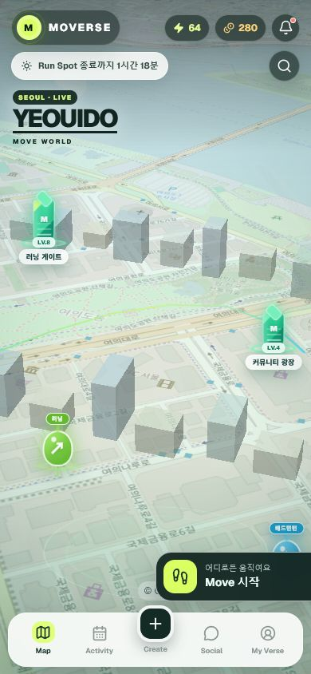
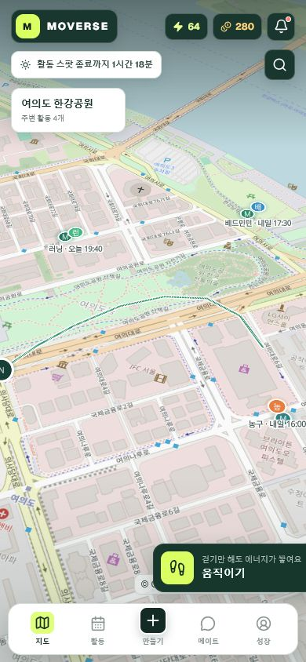
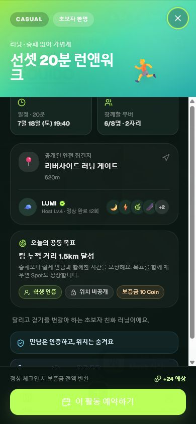
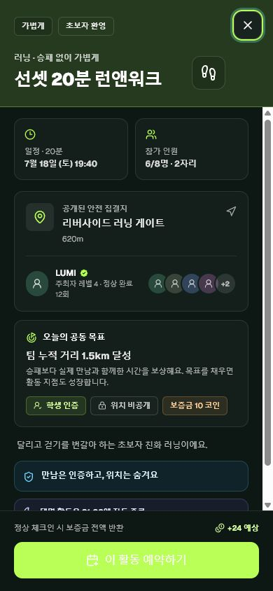
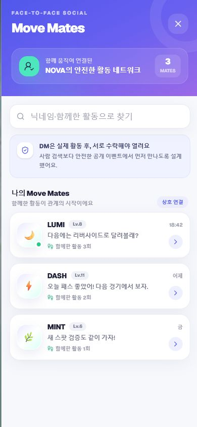
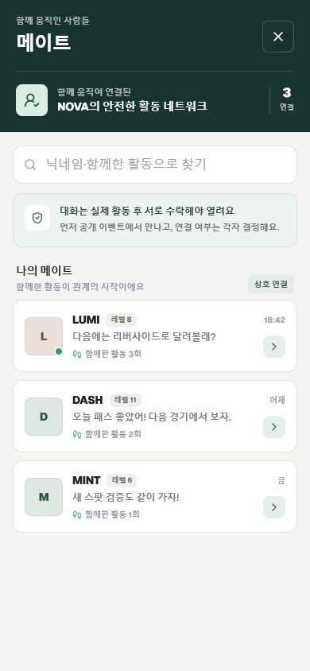
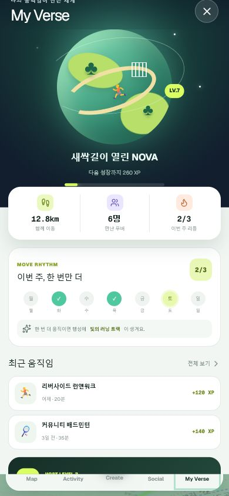
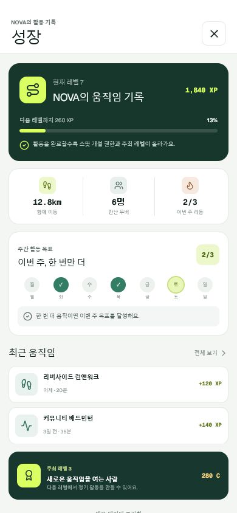
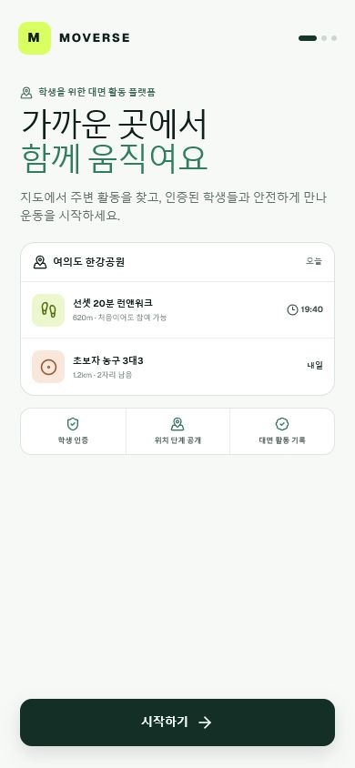

# Moverse UI 감사 및 개선 기록

감사 일시: 2026-07-18  
검증 뷰포트: 390 × 844 px

## 1. 지도 홈

개선 전에는 실제 지도와 무관한 돌출 건물, 지도 밖 DOM 마커, 큰 영문 지역명, 네온과 유리 효과가 한 화면에 겹쳤다. 특히 DOM 마커는 지도 캔버스와 별도로 좌표를 갱신해 이동·확대·회전 중 시각적인 지연이 생길 수 있었다.

개선 후에는 가짜 건물을 제거하고 스팟·이벤트·사용자를 MapLibre GeoJSON 소스와 WebGL 레이어로 통합했다. 지도 객체와 같은 렌더링 경로를 사용하므로 이동·확대·회전 시 좌표가 함께 갱신된다. 지역 정보와 내비게이션은 한국어 중심의 평면형 UI로 정리했다.

상태: 핵심 사용성 문제 해결. 지도 레이어 클릭·호버와 포커스 시 열리는 HTML 활동 목록을 함께 제공한다.

## 2. 활동 상세

개선 전에는 스포츠 이모지, 강한 그라데이션, 영문 모드명, 여러 겹의 둥근 카드가 정보 위계를 흐렸다.

개선 후에는 Lucide 스포츠 아이콘, 단색 스포츠 헤더, 한국어 상태명, 얇은 테두리 기반 패널로 바꿨다. 일정·인원·집결지·안전 정책·예약 행동의 순서가 분명해졌다.

상태: 건강함. 예약, 체크인, 동적 QR, 상호 태그, 활동 완료 흐름을 유지한다.

## 3. 메이트와 대화

개선 전에는 보라색 그라데이션과 이모지 아바타, 장식 영문이 대면 안전 서비스보다 가벼운 콘셉트 화면처럼 보였다.

개선 후에는 이니셜 아바타와 딥그린·중립색 체계를 사용하고, 실제 활동 후 상호 수락한 관계라는 조건을 화면 첫머리에 설명한다.

상태: 건강함. 메이트 목록, DM, 다음 활동 잡기, 신고·차단을 유지한다.

## 4. 성장 기록

개선 전에는 CSS로 만든 행성·건물·러너와 영문 장식 문구가 핵심 보상 구조보다 앞에 보였고, 하단 카드가 화면에 잘렸다.

개선 후에는 레벨·XP·거리·만난 사용자·주간 목표·주최 레벨을 실제 데이터 구조로 보여준다. 스크롤과 하단 여백도 수정했다.

상태: 건강함. 개인 성장과 활동 개최 권한의 순환 구조가 직접 드러난다.

## 5. 온보딩

CSS 미니 행성과 스포츠 이모지 대신, 오늘 가까운 활동 예시와 학생 인증·위치 단계 공개·대면 활동 기록을 첫 화면에서 설명한다.

상태: 건강함. 학생 인증과 관심 종목 선택의 3단계 흐름을 유지한다.

## 접근성 및 회귀 확인

- 지도 위 WebGL 요소와 동일한 활동을 키보드·스크린리더용 HTML 목록에서도 선택할 수 있다.
- 버튼 포커스 표시, 모션 감소 설정, 모바일 안전 영역을 유지했다.
- 위치는 현장 인증 전 비공개라는 정책 문구를 활동 목록과 상세 화면에서 확인할 수 있다.
- `npm run lint`, `npm run typecheck`, `npm run build`, `git diff --check`를 통과했다.
